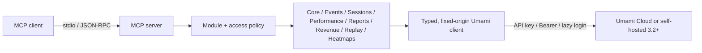

# Umami Compass

**Open-source MCP server for Umami Analytics — Cloud and self-hosted.**


[](https://github.com/webcredo/umami-compass/actions/workflows/ci.yml)
[](https://www.npmjs.com/package/umami-compass)
[](LICENSE)

**Distribution:** [`umami-compass` on npm](https://www.npmjs.com/package/umami-compass) · [`io.github.webcredo/umami-compass` in the official MCP Registry](https://registry.modelcontextprotocol.io/v0.1/servers?search=io.github.webcredo%2Fumami-compass)

Umami Compass is a secure, read-only [Model Context Protocol](https://modelcontextprotocol.io/) server for [Umami Analytics](https://umami.is/). It gives MCP clients accurate Umami 3.2 analytics without exposing a database or allowing arbitrary network requests.

Version `0.1.2` is the current patch release. See [Compatibility](#compatibility) before using it with older Umami versions.

> The `npx` examples follow the stable npm release channel and check it whenever the MCP process starts. For source-based evaluation, clone this repository, run `pnpm install --frozen-lockfile && pnpm build`, and use `node /absolute/path/to/umami-compass/dist/cli.js` as the MCP command.

## Why this project

Existing Umami MCP servers each cover part of the problem, but our July 2026 review found gaps around Umami 3.2 response correctness, Cloud authentication, safety boundaries, or extensibility. Umami Compass sets a higher, testable quality bar:

- Correct auth for both products: `x-umami-api-key` for Umami Cloud and Bearer/login auth for self-hosted instances.
- Umami 3.2-aware responses, including both `pageviews` and `sessions`, Core Web Vitals, funnels, journeys, attribution, retention, revenue, bounded heatmaps, and replay metadata.
- Read-only by construction: every tool declares MCP safety annotations; no create, update, delete, raw HTML, or arbitrary URL tool exists.
- Defense in depth: fixed upstream origin, HTTPS policy, website allowlist, range/page/response-byte caps, request timeout, cancellation propagation, and redacted errors.
- Agent-friendly output: machine-readable `structuredContent`, bounded pages/series/activity/heatmaps, clear descriptions, a resource, and an analytics prompt.
- Contributor-friendly architecture: endpoint modules, dependency-injected HTTP, a central access policy, ADRs, and real MCP integration tests.

See the dated [landscape review](docs/research/umami-mcp-landscape-2026-07.md) for the evidence and methodology.

## Quick start

Requirements: Node.js 22 or newer and an Umami identity with view-only access where possible.

The examples use the auto-updating stable launcher:

```sh
npx --yes --prefer-online umami-compass@latest
```

`@latest` selects the stable npm channel and `--prefer-online` makes npm check the registry even when package metadata is cached. npm still reuses the cached package when that exact release is already present. Updates take effect the next time the MCP process starts; an already running local server cannot replace itself.

Use `umami-compass@next` instead to opt into preview releases. For reproducible CI or centrally managed environments, pin an exact release and omit the online check, for example `npx --yes umami-compass@0.1.2`. Never use the preview channel for an unattended production setup.

### Umami Cloud

```json
{
  "mcpServers": {
    "umami": {
      "command": "npx",
      "args": ["--yes", "--prefer-online", "umami-compass@latest"],
      "env": {
        "UMAMI_API_KEY": "replace-with-your-api-key"
      }
    }
  }
}
```

With `UMAMI_API_KEY` and no URL, the API root defaults to `https://api.umami.is/v1`.

### Self-hosted Umami

```json
{
  "mcpServers": {
    "umami": {
      "command": "npx",
      "args": ["--yes", "--prefer-online", "umami-compass@latest"],
      "env": {
        "UMAMI_URL": "https://analytics.example.com",
        "UMAMI_USERNAME": "mcp-viewer",
        "UMAMI_PASSWORD": "replace-me",
        "UMAMI_WEBSITE_IDS": "6b2c8c10-908c-4a8e-a924-4049eb3bde8c"
      }
    }
  }
}
```

`UMAMI_URL` is an instance origin; `/api` is appended. Use `UMAMI_API_URL` instead when a reverse proxy exposes a custom, exact API root.

`UMAMI_WEBSITE_IDS` is an optional safety allowlist, not a credential. Replace the example UUID with a website ID from Umami (or from `list_websites`), separate multiple IDs with commas, or remove the variable to use every website visible to the account.

Do not commit real credentials. Prefer a dedicated view-only Umami account and the client/OS secret store when available.

## Tools

The least-privilege default `core` set exposes seven aggregate tools. Row-level events, sessions, and other more sensitive modules are opt-in.

| Toolset | Tools | Default |
| --- | --- | --- |
| `core` | `list_websites`, `get_website`, `get_website_stats`, `get_pageviews`, `get_metrics`, `get_active_visitors`, `get_website_date_range` | Yes |
| `events` | `list_events`, `get_event_stats`, `get_event_series` | No |
| `sessions` | `list_sessions`, `get_session_stats`, `get_session`, `get_session_activity` | No |
| `performance` | `get_web_vitals`, `get_performance_breakdown` for LCP, INP, CLS, FCP, and TTFB | No |
| `reports` | Saved reports and segments plus goal, funnel, journey, retention, UTM, attribution, and multi-field breakdown reports | No |
| `revenue` | `get_revenue_stats`, `get_revenue_metrics` | No |
| `replay` | `list_replays` (metadata only; never raw rrweb payloads) | No |
| `heatmaps` | `get_heatmap` (click/scroll pages and bounded detail points) | No |

Set `UMAMI_TOOLSETS=all` or a comma-separated subset. The default has seven tools; `all` has 30. High-cardinality report, performance, heatmap, and activity results carry explicit limits and truncation metadata. The server also exposes the `umami://websites` resource and the `analytics_report` prompt.

## Configuration

Choose exactly one authentication mode.

### Authentication

- `UMAMI_API_KEY` — Umami Cloud/client API key. It is sent only as `x-umami-api-key`.
- `UMAMI_ACCESS_TOKEN` — existing Bearer token.
- `UMAMI_USERNAME` + `UMAMI_PASSWORD` — lazy self-hosted login with a cached token and one refresh on 401.

Authentication variables have no default. Configure only one of the three modes above.

### Endpoint and access scope

- `UMAMI_URL` — self-hosted instance origin; `/api` is appended. With API-key auth and no URL, the default is the Umami Cloud API root.
- `UMAMI_API_URL` — exact API root; takes the place of `UMAMI_URL`. No default.
- `UMAMI_WEBSITE_IDS` — comma-separated website UUID allowlist. Defaults to every site visible to the account.
- `UMAMI_TOOLSETS` — comma-separated toolsets or `all`. Available values are `core`, `events`, `sessions`, `performance`, `reports`, `revenue`, `replay`, and `heatmaps`. Defaults to `core`.

### Safety limits

- `UMAMI_REQUEST_TIMEOUT_MS` — per-request timeout from 1,000 to 120,000 ms. Defaults to `30000`.
- `UMAMI_MAX_RANGE_DAYS` — maximum analytics range from 1 to 3,650 days. Defaults to `366`.
- `UMAMI_MAX_RESPONSE_BYTES` — maximum decoded upstream JSON body from 102,400 to 52,428,800 bytes. Defaults to `10485760`.
- `UMAMI_ALLOW_INSECURE_HTTP` — permits non-loopback HTTP when set to `true`. Defaults to `false`.

HTTPS is mandatory by default. Plain HTTP is accepted automatically only for `localhost`, `127.0.0.1`, and `::1`.

## Client setup

All examples below use Umami Cloud. Export the secret in the environment that launches your client:

```sh
export UMAMI_API_KEY="replace-with-your-api-key"
```

For self-hosted Umami, replace `UMAMI_API_KEY` with the variables shown in [Self-hosted Umami](#self-hosted-umami). Add `UMAMI_TOOLSETS=all` only if the account has the matching Umami section permissions and you want the optional data surfaces.

### Codex CLI, IDE extension, and ChatGPT desktop

Codex clients and ChatGPT desktop on the same host share `~/.codex/config.toml`. `env_vars` forwards the secret without writing its value into the config:

```toml
[mcp_servers.umami-compass]
command = "npx"
args = ["--yes", "--prefer-online", "umami-compass@latest"]
env_vars = ["UMAMI_API_KEY"]
```

Run `codex mcp list` or `/mcp` to verify it. In the Codex IDE extension or ChatGPT desktop, you can also open **MCP servers**, add a **STDIO** server with command `npx --yes --prefer-online umami-compass@latest`, then restart the client. See the official [Codex and ChatGPT MCP guide](https://developers.openai.com/codex/mcp/).

ChatGPT web does not read local Codex config. The current package is local stdio; a hosted plugin requires the future authenticated remote transport.

### Claude Code

Use user scope to keep the personal server outside the repository:

```sh
claude mcp add --scope user --transport stdio \
  --env UMAMI_API_KEY="$UMAMI_API_KEY" \
  umami-compass -- npx --yes --prefer-online umami-compass@latest
```

Verify with `claude mcp list` or `/mcp`. For a team-safe `.mcp.json`, Claude Code supports `${UMAMI_API_KEY}` expansion; never commit the actual value. See the official [Claude Code MCP guide](https://code.claude.com/docs/en/mcp).

### Claude Desktop

Open **Settings → Developer → Edit Config**. On macOS the file is `~/Library/Application Support/Claude/claude_desktop_config.json`; on Windows it is `%APPDATA%\Claude\claude_desktop_config.json`.

```json
{
  "mcpServers": {
    "umami-compass": {
      "command": "npx",
      "args": ["--yes", "--prefer-online", "umami-compass@latest"],
      "env": {
        "UMAMI_API_KEY": "replace-with-your-api-key"
      }
    }
  }
}
```

Protect the config file because this client format stores the value, then fully quit and restart Claude Desktop. See the official [local MCP server guide](https://modelcontextprotocol.io/docs/develop/connect-local-servers).

### Cursor

Put this in the private global `~/.cursor/mcp.json`, or in `.cursor/mcp.json` only when it contains no real credentials:

```json
{
  "mcpServers": {
    "umami-compass": {
      "command": "npx",
      "args": ["--yes", "--prefer-online", "umami-compass@latest"],
      "env": {
        "UMAMI_API_KEY": "replace-with-your-api-key"
      }
    }
  }
}
```

Enable the server in **Cursor Settings → MCP**. See the official [Cursor MCP documentation](https://docs.cursor.com/context/model-context-protocol).

### VS Code / GitHub Copilot

Use **MCP: Open User Configuration** for a personal config, or `.vscode/mcp.json` for a shared command. VS Code uses `servers` (not `mcpServers`) and can prompt for a masked secret:

```json
{
  "inputs": [
    {
      "type": "promptString",
      "id": "umami-api-key",
      "description": "Umami API key",
      "password": true
    }
  ],
  "servers": {
    "umami-compass": {
      "type": "stdio",
      "command": "npx",
      "args": ["--yes", "--prefer-online", "umami-compass@latest"],
      "env": {
        "UMAMI_API_KEY": "${input:umami-api-key}"
      }
    }
  }
}
```

Run **MCP: List Servers** to start, inspect, or troubleshoot it. See the official [VS Code MCP guide](https://code.visualstudio.com/docs/agent-customization/mcp-servers).

### Gemini CLI

Add this to the user-level `~/.gemini/settings.json` (or project `.gemini/settings.json`). Gemini expands shell variables in `env`:

```json
{
  "mcpServers": {
    "umami-compass": {
      "command": "npx",
      "args": ["--yes", "--prefer-online", "umami-compass@latest"],
      "env": {
        "UMAMI_API_KEY": "$UMAMI_API_KEY"
      },
      "trust": false
    }
  }
}
```

Verify with `gemini mcp list` or `/mcp`. See the official [Gemini CLI MCP guide](https://geminicli.com/docs/tools/mcp-server/).

### Troubleshooting

- Run `npx --yes --prefer-online umami-compass@latest --version` first; Node.js 22+ is required.
- After a package update, restart the MCP server so the client requests the new tool list. A client still showing an old or empty list may also need its cached tools cleared.
- `401` means the credential or auth mode is wrong; `403` can mean the Umami account lacks permission for that website section.
- For self-hosted local development, `http://localhost:3000` is allowed. Other plain HTTP origins require the explicit unsafe opt-in.
- Start with the default toolsets. Enable `performance`, `reports`, `revenue`, `replay`, or `heatmaps` only as needed.
- Enable `events` or `sessions` only when the client needs row-level data and the Umami identity is allowed to expose it.

## Architecture



The package intentionally ships stdio first. A public HTTP transport needs OAuth 2.1, tenant isolation, rate limits, and an operational threat model; binding an unauthenticated endpoint would weaken the project.

Future management tools are anticipated but cannot slip into the read-only build accidentally. Every module declares `access: "read" | "write"`, and the server rejects write modules under the default policy. See [architecture](docs/architecture.md) and [ADR-0001](docs/adr/0001-read-only-core-and-write-policy.md).

See the [Umami 3.2 API coverage matrix](docs/research/umami-api-coverage-3.2.md) for what is implemented, deliberately excluded, and prioritized next.

## Development

```sh
corepack enable
pnpm install --frozen-lockfile
pnpm check
pnpm dev
```

To add an endpoint, follow [Adding a tool](docs/adding-a-tool.md). For project expectations and pull requests, see [CONTRIBUTING.md](CONTRIBUTING.md).

## Compatibility

- Umami 3.2.x is the reference implementation and test target.
- Older Umami releases may work for unchanged endpoints but are not promised yet.
- Node.js 22, 24, and 26 are tested in CI.
- MCP SDK v1 is used because it is the stable production line as of July 2026; the v2 branch is still pre-release.

## Security and privacy

Analytics, session metadata, revenue, and replay metadata can be sensitive. Use least-privilege credentials, an allowlist, the smallest toolset, and short time ranges. Read [SECURITY.md](SECURITY.md) before production use.

Umami Compass is an independent community project and is not affiliated with Umami Software.

## License

[MIT](LICENSE) © 2026 webcredo and Umami Compass contributors.
